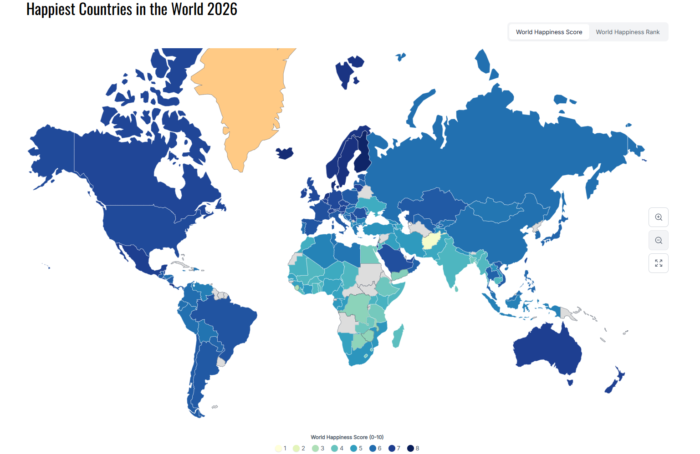

# Overview

This project is focused on redesigning the data from the World Happiness Report (2023-2025).

Although the data is presented with an interactive map, it can be improved to see countries that are improving on their happiness score over the years. The World Happiness Report utilizes the respective country's "gross domestic product per capita, social support, healthy life expectancy, freedom to make your own life choices, generosity of the general population, and perceptions of internal and external corruption levels" to compute scores which determine the happiness ranking. The score for one year is used by averaging the score from the previous 3 years. An example would be the 2025 happiness score would be the average from 2022-2024.

{fig-align="center"}

Above is the original interactive map displayed by the World Happiness Report.

Through this map, as well as the written report on their website, it is fairly straightforward to find the top ranked happiest countries. I believe with this data it is also possible to find countries that are developing and increasing their country's happiness.
